# BaseSecu-VulnScanner
> Projet de base de la sécu, A3 S1 CPE.

## Sommaire

- [Contexte](#contexte)
- [Consignes & description du projet](#consignes--description-du-projet)
  - [Objectifs](#objectifs)
  - [Travail attendu](#travail-attendu)
  - [Livrables](#livrables)
- [Présentation de la solution](#présentation-de-la-solution)
- [Fonctionnalités](#fonctionnalités)
- [Utilisation](#utilisation)
  - [Prérequis](#prérequis)
  - [Installation](#installation)
  - [Configuration](#configuration)
  - [Exécution](#exécution)
- [Documentation](#documentation)

## Contexte

Dans un contexte de multiplication des cybermenaces, les entreprises doivent être capables
d’identifier rapidement les vulnérabilités présentes dans leur système d’information. Cependant, la
détection et la corrélation manuelle entre les actifs d’un réseau (matériels, logiciels, services) et les
bases de connaissance de menaces (CTI : Cyber Threat Intelligence) constituent une tâche complexe
et chronophage.
Ce projet vise à développer un outil capable de scanner automatiquement une infrastructure réseau
afin d’identifier les matériels, logiciels et services présents, puis de faire correspondre ces éléments
avec les bases de données CTI (telles que CVE, CWE, et CPE) pour détecter les vulnérabilités connues
affectant les composants identifiés.

## Consignes & description du projet

### Objectifs

1. Cartographier automatiquement une infrastructure réseau (machines, ports, services, versions logicielles).  
2. Collecter des informations CTI (OpenCTI, CVE, CWE, CPE, NVD, etc.).  
3. Faire le matching entre les composants détectés et les vulnérabilités connues.  
4. (Optionnel) Générer un rapport de vulnérabilité présentant les éléments à risque, leur criticité et les correctifs recommandés.  
5. (Optionnel) Proposer une visualisation graphique du réseau et des vulnérabilités associées.  

### Travail attendu

- Utilisation d’un outil de scan réseau
- Extraction des données CTI depuis les bases publiques
- Conception d’un algorithme ou d’un pipeline pour faire la correspondance entre le scan et les
vulnérabilités.
- (Bonus) Intégration d’un modèle de scoring de risque ou d’une priorisation des vulnérabilités
selon leur criticité (CVSS).
- (Bonus) Développement d’une interface web simple pour visualiser les résultats.

### Livrables
- Code source de l’outil ou du prototype développé
- Rapport technique détaillant la démarche, les choix techniques et les résultats
- Démonstration ou présentation du fonctionnement de la solution

## Présentation de la solution

La solution développée est un scanner de vulnérabilités automatisé qui collecte des informations CTI et fait le matching entre les composants détectés et les vulnérabilités connues. L'outil se base sur le matching entre CPE (Common Platform Enumeration) et CVE (Common Vulnerabilities and Exposures) pour identifier les vulnérabilités associées aux paquets présents sur les actifs Linux d'un réseau.

**Note**: La majorité des commentaires et documentations techniques dans le code sont en anglais pour respecter les standards internationaux de développement logiciel. Cependant, cette présentation et le README principal sont en français pour une meilleure compréhension dans le contexte académique.

L'outil utilise le modèle LLM `Gemini Flash 2.5` de Google pour générer automatiquement les CPE (Common Platform Enumeration) à partir des noms de paquets et des informations matérielles, garantissant une correspondance précise avec la base de données NVD (National Vulnerability Database).

## Fonctionnalités

### Fonctionnalités implémentées ✓

#### 1. Scan automatique des machines
- **Découverte de paquets Linux** via SSH (connexion sécurisée)
- **Détection des versions** des logiciels installés
- **Gestion du cache** pour optimiser les requêtes répétées
- **Support de configuration INI** pour gérer plusieurs machines

#### 2. Génération intelligente de CPE
- **IA basée sur Gemini** pour conversion paquet → CPE
- **Validation de format** CPE 2.3 standard
- **Caching** des CPE générés pour éviter les requêtes redondantes
- **Support multi-paquet** avec traitement par lots

#### 3. Scanning de vulnérabilités logicielles
- **Intégration NVD API** pour requêtes CVE/CWE
- **Respect des limites de débit** (50 requêtes/30s)
- **Gestion des erreurs** (404, 429, 503)
- **Récupération détaillée** des descriptions CVE
- **Cache SQLite** pour optimisation

#### 4. Scanning de vulnérabilités matérielles
- **Détection CPU** via `lscpu` (microarchitecture)
- **Génération CPE matérielle** spécialisée
- **Identification** des vulnérabilités CPU (Spectre, Meltdown, etc.)
- **Fusion** automatique avec vulnérabilités logicielles

#### 5. Génération de rapports
- **Rapports JSON** structurés par CPE
- **Rapports HTML interactifs** avec visualisations
- **Intégration CVE.org** pour liens vers détails
- **Statistiques** de synthèse

#### 6. Visualisation réseau
- **Génération SVG** des topologies réseau (via Nmap)
- **Intégration dans rapports HTML** automatique
- **Support multi-machines** avec un diagramme par hôte
- **Embedding direct** sans dépendances externes

### Fonctionnalités non implémentées

- **Machines Windows** (en cours de développement)
- **Dashboard web complet** (seuls les rapports HTML sont générés)
- **Scoring CVSS intégré** (les données brutes sont disponibles)

## Schématisation du fonctionnement

```mermaid

flowchart TD
    Start([Démarrage]) --> ParseArgs["📋 Parser Arguments<br/>(inventory, --flush-cache, etc)"]
    ParseArgs --> LoadConfig["⚙️ Charger Inventory<br/>(inventory.ini)"]
    LoadConfig --> ReportOnly{Mode<br/>--report-only?}
    
    ReportOnly -->|Oui| GenReportCache["📊 Générer Rapport HTML<br/>depuis le cache"]
    GenReportCache --> HTMLOut["🌐 Rapport HTML<br/>(SVG intégré)"]
    HTMLOut --> End1([Fin])
    
    ReportOnly -->|Non| FlushDecision{--flush-cache?}
    FlushDecision -->|Oui| FlushCaches["🗑️ Vider Caches<br/>(CPE, packages, DB)"]
    FlushCaches --> InitGenAI
    FlushDecision -->|Non| InitGenAI["🤖 Initialiser Google GenAI<br/>(Gemini 2.5 Flash)"]
    
    InitGenAI --> TestNVD["🔍 Tester Connexion NVD API<br/>(CPE test: log4j 2.14.1)"]
    TestNVD --> MachineLoop["🔄 Boucler sur chaque Machine"]
    
    MachineLoop --> SkipDefault{Machine<br/>= DEFAULT?}
    SkipDefault -->|Oui| NextMachine["↪️ Machine suivante"]
    SkipDefault -->|Non| CheckType{Type<br/>= linux?}
    
    CheckType -->|Non| NextMachine
    CheckType -->|Oui| GetPackages["📦 Récupérer Packages<br/>(SSH + pkg_finder)"]
    
    GetPackages --> CompareCache["🔄 Comparer avec Cache<br/>(machines/{machine}/installed_packages.json)"]
    CompareCache --> DetectNew["🆕 Détecter Nouveaux Packages<br/>(--force-check: tous les packages)"]
    
    DetectNew --> NoNew{Nouveaux?}
    NoNew -->|Non| LoadHardware
    NoNew -->|Oui| GenerateCPE["🎯 Générer CPE<br/>(AI GenAI - batch processing)"]
    
    LoadHardware["⚙️ Charger Info Matériel<br/>(lscpu - CPU)"]
    GenerateCPE --> CachePackages["💾 Cacher Packages<br/>(cpe_cache.json)"]
    CachePackages --> LoadHardware
    
    LoadHardware --> GenHWCPE["🎯 Générer CPE Matériel<br/>(CPU vulnérabilités)"]
    GenHWCPE --> QueryNVD["🔗 Interroger NVD API<br/>(vulnerability_checker.py)"]
    
    QueryNVD --> CheckCache["🔍 Vérifier Cache SQLite<br/>(cache_db.py)"]
    CheckCache --> CacheHit{Dans<br/>cache?}
    
    CacheHit -->|Oui| UseCache["✅ Utiliser Vulnérabilités<br/>en cache"]
    CacheHit -->|Non| APICall["📡 Appel NVD API<br/>(rate limit: 0.6s)"]
    
    APICall --> HandleErrors{"Code<br/>HTTP?"}
    HandleErrors -->|429/503| Backoff["⏸️ Backoff Exponentiel<br/>(exponential delay)"]
    HandleErrors -->|404| ContinueNext
    HandleErrors -->|200| ParseVuln["📊 Parser Vulnérabilités<br/>(CVE, CVSS, CWE)"]
    
    Backoff --> APICall
    ParseVuln --> StoreSQLite["💾 Stocker en Cache SQLite<br/>(vulnerabilities table)"]
    UseCache --> StoreSQLite
    StoreSQLite --> ContinueNext["↪️ Package/CPE suivant"]
    
    ContinueNext --> AllPkgDone{Tous<br/>traités?}
    AllPkgDone -->|Non| QueryNVD
    AllPkgDone -->|Oui| GenJSONReport["📄 Générer Rapport JSON<br/>(machines/{machine}/vulnerability_report.json)"]
    
    GenJSONReport --> FormatOutput["🖥️ Formatter Output Terminal<br/>(Colors + Stats)"]
    FormatOutput --> NextMachine
    
    NextMachine --> AllMachines{Toutes<br/>machines?}
    AllMachines -->|Non| MachineLoop
    AllMachines -->|Oui| GenHTML["📊 Générer Rapport HTML Global<br/>(html_report_generator)"]
    
    GenHTML --> EmbedSVG["🎨 Intégrer SVG Réseau<br/>(network_visualizer)"]
    EmbedSVG --> HTMLReport["🌐 Rapport HTML Final<br/>(cache/vulnerability_report.html)"]

    HTMLReport --> End2([Fin])

```



### Explication du Flux Principal

**Phase 1: Initialisation**
1. Charger la configuration (inventory.ini)
2. Tester la connexion NVD API
3. Initialiser Google GenAI (une seule fois)

**Phase 2: Découverte par Machine**
1. Récupérer les packages via SSH
2. Détecter les nouveaux packages (cache delta)
3. Générer des CPE via GenAI (batch processing)
4. Récupérer les infos matérielles (CPU)
5. Générer CPE matériels

**Phase 3: Matching Vulnérabilités**
1. Vérifier le cache SQLite d'abord
2. Si manquant, interroger l'API NVD
3. Respecter les limites de débit (0.6s entre requêtes)
4. Gérer les erreurs API (backoff exponentiel)
5. Stocker en cache pour les exécutions suivantes

**Phase 4: Reporting**
1. Générer des rapports JSON par machine
2. Formatter la sortie terminal
3. Créer un rapport HTML global
4. Intégrer les visualisations réseau (SVG)

## Utilisation

### Prérequis

- **Python 3.10+** 
- **SSH** configuré et accessible sur les machines cibles
- **Nmap** et **Graphviz** (pour visualisation réseau, optionnel)
- **Clés API**:
  - Google GenAI (gratuit, avec limite)
  - NVD NIST (gratuit, avec limite de débit)

### Installation

1. **Cloner le dépôt**:
   ```bash
   git clone https://github.com/Y0plait/BaseSecu-VulnScanner.git
   cd BaseSecu-VulnScanner
   ```

2. **Créer et activer un environnement virtuel** (optionnel mais recommandé):
   ```bash
   python3 -m venv .env
   source .env/bin/activate  # macOS/Linux
   # ou
   .env\Scripts\activate     # Windows
   ```

3. **Installer les dépendances**:
   ```bash
   pip install -r requirements.txt
   ```

### Configuration

#### 1. Configurer les machines à scanner

Modifier `inventory.ini`:

```ini
[srv01]
host = 192.168.1.10
user = admin
password = secret_password
type = linux

[srv02]
host = srv02.example.com
user = admin
password = 
type = linux

# Les connexions sans password utiliseront les clés SSH configurées localement
```

**Paramètres:**
- `host`: Adresse IP ou nom de domaine (requis)
- `user`: Utilisateur SSH (requis)
- `password`: Mot de passe SSH (vide pour clés SSH)
- `type`: Type de machine (`linux` ou `windows` - seul linux est implémenté)

#### 2. Configurer les clés API

Créer un fichier `.env` à la racine du projet:

```bash
cat > .env << 'EOF'
GENAI_API_KEY=votre_clé_genai_ici
NVD_NIST_CPE_API_KEY=votre_clé_nvd_ici
EOF
```

**Où obtenir les clés:**
- **Google GenAI API Key**: https://aistudio.google.com
- **NVD NIST API Key**: https://nvd.nist.gov/developers/request-an-api-key

⚠️ **Important**: Ne jamais ajouter `.env` à git! Le fichier est automatiquement ignoré.

#### 3. (Optionnel) Configurer la visualisation réseau

Pour générer les visualisations de topologie réseau:

```bash
# Installer les dépendances
brew install nmap graphviz        # macOS
sudo apt-get install nmap graphviz graphviz-dev  # Debian/Ubuntu

# Installer nmap-formatter
go install github.com/vdjagilev/nmap-formatter/v3@latest
# Ou télécharger le binaire depuis: https://github.com/vdjagilev/nmap-formatter/releases
```

Placer le binaire `nmap-formatter` à la racine du projet.

### Exécution

#### Scan complet avec rapport

```bash
python main.py --inventory inventory.ini
```

#### Options disponibles

```bash
# Afficher l'aide
python main.py --help

# Utiliser un fichier inventory personnalisé
python main.py --inventory custom_inventory.ini

# Vider tous les caches avant de scanner
python main.py --flush-cache

# Vérifier TOUS les paquets (même ceux déjà vérifiés)
python main.py --force-check

# Générer le rapport HTML à partir du cache (sans scanner les machines)
python main.py --report-only

# Combiner plusieurs options
python main.py --inventory custom.ini --flush-cache --force-check
```

#### Exemple complet

```bash
# Premier scan avec nouveau fichier inventory
python main.py --inventory production_inventory.ini

# Vérifier à nouveau tous les paquets (après mise à jour NVD)
python main.py --force-check

# Régénérer les rapports HTML sans re-scanner
python main.py --report-only
```

#### Fichiers générés

Après l'exécution, les fichiers suivants sont créés:

```
cache/
├── machines/
│   ├── srv01/
│   │   ├── installed_packages.json      # Liste des paquets détectés
│   │   ├── cpe_list_srv01.txt           # CPE générés (paquets)
│   │   ├── cpe_list_srv01_hw.txt        # CPE générés (matériel)
│   │   └── vulnerability_report.json    # Vulnérabilités au format JSON
│   ├── srv02/
│   └── ...
├── cpe_cache.json                       # Cache global des CPE
└── vulnerability_cache.db               # Cache SQLite des CVE

logs/
└── vulnerability_scan_YYYYMMDD_HHMMSS.log  # Journal d'exécution

cache/vulnerability_report.html          # Rapport HTML final
```

## Documentation

La documentation complète est organisée comme suit:

- **[QUICK_START.md](docs/QUICK_START.md)** - Guide de démarrage rapide (5 minutes)
- **[INSTALLATION.md](docs/INSTALLATION.md)** - Guide d'installation détaillé avec dépannage
- **[STRUCTURE.md](docs/STRUCTURE.md)** - Architecture du code et modules
- **[HARDWARE_SCANNING.md](docs/HARDWARE_SCANNING.md)** - Détails du scanning matériel
- **[NETWORK_VISUALIZATION.md](docs/NETWORK_VISUALIZATION.md)** - Détails de la visualisation réseau
- **[SCAN.md](docs/SCAN.md)** - Guide de configuration du scanning réseau
- **[DOCUMENTATION.md](docs/DOCUMENTATION.md)** - Documentation technique détaillée (anglais)

### Légende des fichiers

| Fichier | Langue | Contenu |
|---------|--------|----------|
| QUICK_START.md | FR | Installation et premiers pas |
| INSTALLATION.md | FR | Configuration avancée |
| STRUCTURE.md | FR | Architecture du code |
| HARDWARE_SCANNING.md | FR | Détails technique scanning CPU |
| NETWORK_VISUALIZATION.md | FR | Détails technique visualisation |
| SCAN.md | FR | Configuration nmap/network |
| DOCUMENTATION.md | EN | Référence API/code détaillée |
